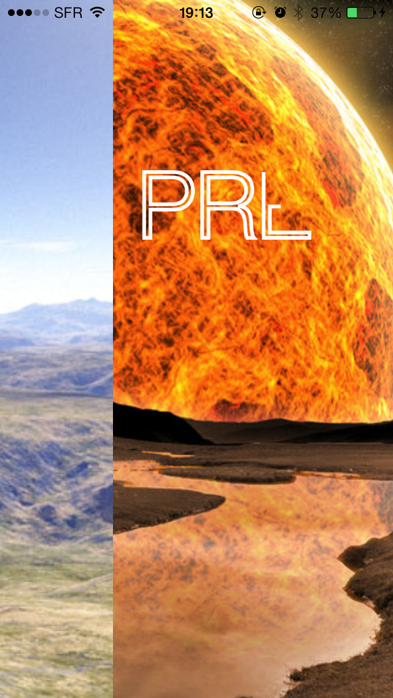
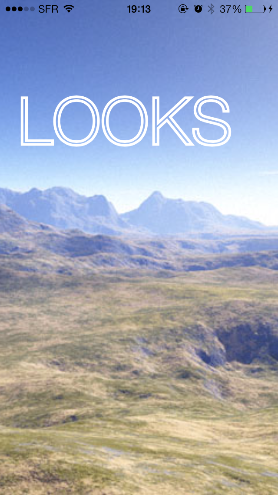

#MPParallaxCollection

A collection view layout and a cell subclass usefull to made parallax of an image during the scrolling.
But even thanks to the delegate useful to make cool percent driven effect, in the example I used my [MPTextReveal](https://github.com/MP0w/MPTextReveal)
to show you how to use.

## Usage

To run the example project, clone the repo, and run `pod install` from the Example directory first.

## Requirements

## Installation

MPParallaxCollection is available through [CocoaPods](http://cocoapods.org). To install
it, simply add the following line to your Podfile:

    pod "MPParallaxCollection"

## Author

Alex Manzella, manzopower@icloud.com

## License

MPParallaxCollection is available under the BSD license. See the LICENSE file for more info.

